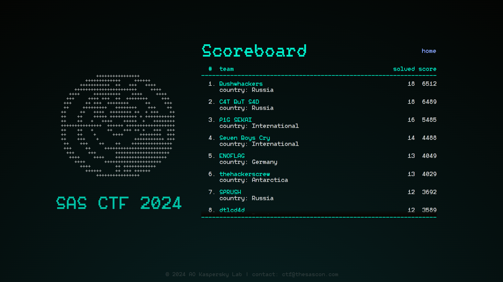

# SAS CTF 2024 Quals

https://ctf.thesascon.com \
https://ctftime.org/event/2299

**Flag format:** SAS{}  
**Duration:** 24 hours

## Partners
- [Kaspersky Academy](https://academy.kaspersky.com/)
- [Yandex.Cloud](https://yandex.cloud/en/)
- [Drovosec](https://drovos.ec)

## Organization team
**Lead:** [@bzvr](https://github.com/bzvr) \
**DevOps:** [@kochanac](https://github.com/kochanac) \
**Platform backend:** [@bzvr](https://github.com/bzvr), [@kochanac](https://github.com/kochanac) \
**Platform frontend:** [@twosd](https://t.me/twosd), [@kumfc](https://github.com/kumfc)

## Tasks

| Name | Category | Authors |
|------|----------|---------|
|[foREGround](tasks/forensics-foreground)|forensics|[@2igosha](https://github.com/2igosha)|
|[ice cReAM](tasks/forensics-icecream)|forensics|[@AV1ct0r](https://github.com/AV1ct0r)|
|[CHIPI CHIPI CHAPA CHAPA](tasks/forensics-autoit)|forensics|[@gkucherin](https://github.com/gkucherin)|
|[Cloud Storage](tasks/reverse-cloud-storage)|reverse|[@3vilWind](https://github.com/3vilWind)|
|[CK0P0 CTYXHET](tasks/reverse-nuclear-panel)|reverse|[@3vilWind](https://github.com/3vilWind)|
|[ebin](tasks/reverse-ebin)|reverse|[@kumfc](https://github.com/kumfc)|
|[Napoleon](tasks/reverse-windriver)|reverse|[@gkucherin](https://github.com/gkucherin), [@sherif_magdy](https://keybase.io/sherif_magdy)|
|[Secret meringue recipe](tasks/reverse-meringue)|reverse|[@gkucherin](https://github.com/gkucherin)|
|[Petushok](tasks/misc-petushok)|misc|[@spacewasp](https://github.com/spacewasp)|
|[Lignohakisto](tasks/misc-esperanto)|misc|[@irdkwmnsb](https://github.com/irdkwmnsb)|
|[Last Lang](tasks/misc-last-lang)|misc|[@3vilWind](https://github.com/3vilWind)|
|[Ubercaged](tasks/pwn-ubercaged)|pwn|[@m4drat](https://github.com/m4drat)|
|[Download Moment](tasks/web-download-moment)|web & pwn|[@kumfc](https://github.com/kumfc), [@m4drat](https://github.com/m4drat)|
|[Earn Online for Bored Men](tasks/web-binary-options)|web|[@kumfc](https://github.com/kumfc)|
|[Bad old days](tasks/web-qr-xss)|web|[@kumfc](https://github.com/kumfc) (frontend by [@gurevnind](https://www.behance.net/gurevnind) and [@d_zaretskiy](https://t.me/d_zaretskiy))|
|[Drovosec the Game](tasks/ppc-drovosec)|ppc|[@MaksTresh](https://github.com/MaksTresh), [@kumfc](https://github.com/kumfc)|
|[Turings gold nugget](tasks/ppc-turing-lol)|ppc|[@irdkwmnsb](https://github.com/irdkwmnsb)|
|[Minotaurs guest](tasks/minecraft-minotaur)|minecraft|[@irdkwmnsb](https://github.com/irdkwmnsb)|
|[Parkour school](tasks/minecraft-parkour)|minecraft|[@irdkwmnsb](https://github.com/irdkwmnsb)|
|[Signed message](tasks/minecraft-signed)|minecraft|[@irdkwmnsb](https://github.com/irdkwmnsb)|
|[Vobla Tails](tasks/stego-vobla)|stego|[@bzvr](https://github.com/bzvr)|
