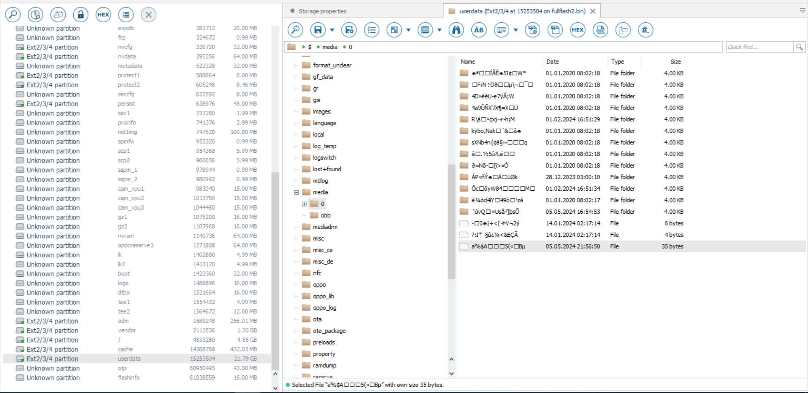

## Title
ice cReAM

## Description
Unexpectedly, all files in my smartphone's backup became encrypted and got a "c" attribute after the latest firmware update.

I've done a "cold boot" RAM capture just in case, but I have no idea how to recover my files from it...

HINT 1. Realme3-kernel-source \
HINT 2. fscrypt_policy_v1 \
HINT 3. inline_encryption \
HINT 4. iv = (number of sectors from the beginning of the image, 0, 0, 0)

## Solution
1. Open `fullflash.bin` in `UFS Explorer`. Seems like per-file encryption (FBE, fscrypt) is in use.

2. We can see "c" attribute next to some files and directories with unreadable filenames. They look like:
```
   0x017F0400, 0x735B1D55CFC20286, 0x10 bytes nonce
   0x017F0400, 0x7F794CC2EC5E1855, 0x10 bytes nonce
   0x017F0400, 0x8BFF6608F979CBA3, 0x10 bytes nonce
```

3. To get further, we'll look into the sources of Android and fscrypt. We need `fscrypt_policy_v1` structure https://github.com/torvalds/linux/blob/master/include/uapi/linux/fscrypt.h

```c
struct fscrypt_policy_v1 {
	__u8 version;
	__u8 contents_encryption_mode;
	__u8 filenames_encryption_mode;
	__u8 flags;
	__u8 master_key_descriptor[FSCRYPT_KEY_DESCRIPTOR_SIZE];
};
```

Example for one of the encrypted files:

```
version = 1
contents_encryption_mode = 0x7F
filenames_encryption_mode = 0x04 = FSCRYPT_MODE_AES_256_CTS 
flags = 0
0x735B1D55CFC20286, 0x7F794CC2EC5E1855, 0x8BFF6608F979CBA3 // Encryption key identifiers.
```

4. Source code also indicates that the key identifier is a beginning of double sha512 from the encryption key itself. The key size is 64 bytes. 

Calculating the key identifier pseudocode:

```php
  $key = "...";
  $h = hash('sha512', hash('sha512', $key, true), true);
  echo "[Key Identifier] fscrypt:".bin2hex(substr($h, 0, 8))."\n";
```

5. Knowing that, we can search the RAM image for 64-byte strings for which the beginning of the double sha512 hash matches one of the key identifiers. To fasten the search, we can narrow down the search ranges to +-128 bytes near occurencies of the corresponding key identifier. This assumption ties to how keys are stored in the kernel keyring.

There's 2 matching keys:
```
E5EC67806054CD9B6724AB9A65C809B36AE51C0DED072C5D442719664A5990B6767B76C3524C2798264937672DF215AC7B589CB17FE839BEBB0768D00FF58D9B (identifier = 0x735B1D55CFC20286)
26AF0D392B1AA1C4281BDD4604DF936B9DE58AE71915724A11F3B624F0D43C825FCBC8CDCAD0F502FEF65DBAA788BFD22B2CC95164D34ED57EDBFBBDDD3C501D (identifier = 0x7F794CC2EC5E1855)
```

Remembering this is a "cold boot" image, we can search for the keys again but flipping 1-2 bits this time. There's the last key:
```
23DA98D7147E0CB94CA5410CF54D618D08967BB40DBD4EBC1EF759E8FBACFE1EA49C72177291A76CB6478E717E42C7C3E2B8236F603BF00EF2B140DBDEF13C21 (identifier = 0x8BFF6608F979CBA3)
```
In the memory it has 1 bit of error and appears as:
```
23DA88D7147E0CB94CA5410CF54D618D08967BB40DBD4EBC1EF759E8FBACFE1EA49C72177291A76CB6478E717E42C7C3E2B8236F603BF00EF2B140DBDEF13C21
```

6. Directory `/data/media/0/` contains a 35 byte file with the last modification in May, the content and the filename is unreadable, hence possibly encrypted


7. In `/vendor/etc/fstab.mt6771` we can see that files are encrypted with `aes-256-xts` (default for fscrypt). There's no need to decrypt the filename though, only it's content.
This smartphone uses deprecated inline-encryption (FBE key is used for decryption, without generation of subkey with nonce). Generating a subkey with nonce is required to decrypt the filename (which is not the need in our case).

8. The last step is to understand the iv generation process (512 byte sector count from the start if the image, nor from the start of userdata). 
It can be found in the kernel source https://github.com/realme-kernel-opensource/Realme3-kernel-source (or just bruteforced).

**File decryption script:** [decrypt_file.php](writeup/decrypt_file.php)


## Flag
SAS{c0ld_r4md4mp_f0r_4ndr01d_FBE}

**Solved by:** 0 teams