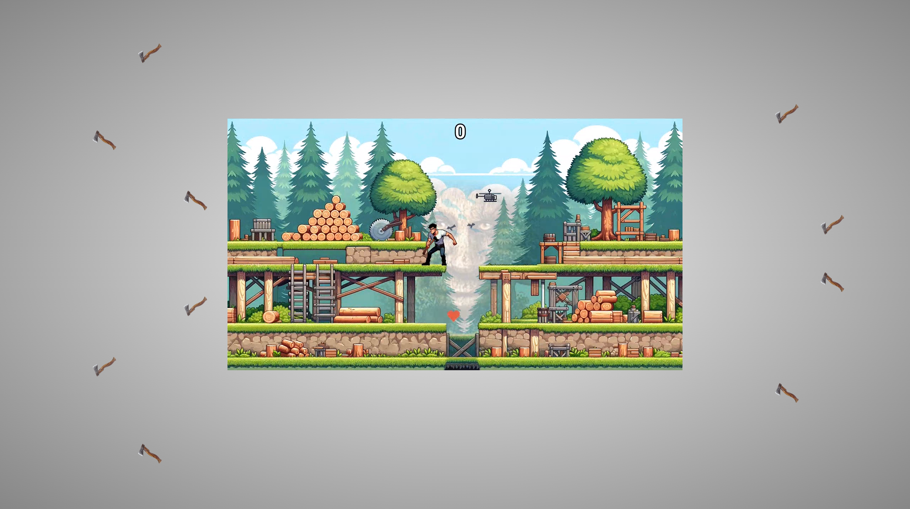

## Title
Drovosec the Game

## Description
If you're above 25 and you have a computer - this game is must play!

## Solution
Idea of the author's solution:
1) Diff every frame with the clean frame
2) Count diff pixels inside the zones of interest (areas where logs and beavers spawn)
3) When there's an object - decide it's type by mean color in the zone
4) When diff pixel count for this zone goes back to normal ranges - calculate the estimated number of frames before we should attack (attack delay can be tuned via ATTACK_FRAMES for different ping)
```python
def frames_ETA(elapsed_frames, platform_length):
    return ceil(
        (platform_length - SPAWN_ZONE_SIZE[0]) / (SPAWN_ZONE_SIZE[0] / elapsed_frames)
        - ATTACK_FRAMES
    )
```
5) Attack logs, skip beavers, win!

*Gameplay process is visualized with cv2*

The exploit is located in the writeup directory.

## Flag
SAS{N0_B0BRS_W3R3_H4RM3D}

**Solved by:** 5 teams