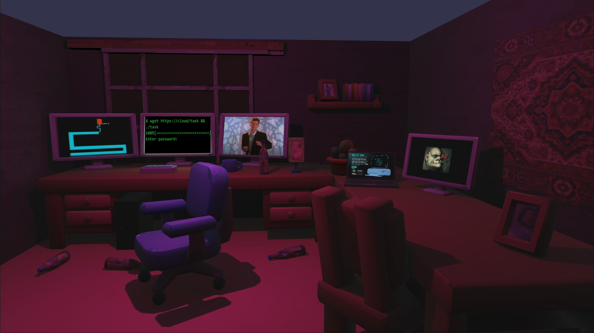

## Title
Cloud Storage

## Description
You just woke up in your dream apartment, got a new reversing task from your boss with a suspicious link to ... a cloud, and got straight to work

## Solution

- Open html, find app and wgsl shaders code

- In the fragment shader, we can see that the particle's colour comes from pixels of some texture
```
let norm = f32((u32(color1.x) % 4) + (u32(color1.y) % 4) * 4 + (u32(color2.y) % 4) * 16 + (u32(color2.z) % 4) * 64) / 255.0;
fragmentOutputs.color = vec4f(norm, norm, norm, 1);
```

- So we need to extract this data somehow, it's possible to just print some array from js, or extract .glb file embedded in .html and get texture with id mentioned in app code

- Use logic from fragment shader to extract bytes

- Particles flow into computer in order which we can find in a js array

- Apply this order to extracted bytes to get elf executable which asks for password

- It checks length of password and tries to do arithmetic encoding into double and checks its result, then uses this password to decrypt flag using RC4

- It's possible to use symbolic execution or just decode it manually

- Enter password "humuhumunukunukuapuaa"

## Flag
SAS{r3v3r53r5_d0_n07_5l33p_r3v3r53r5_r3v3r53_7h3_cl0ud_1n70_7h3_fl46}

**Solved by:** 0 teams