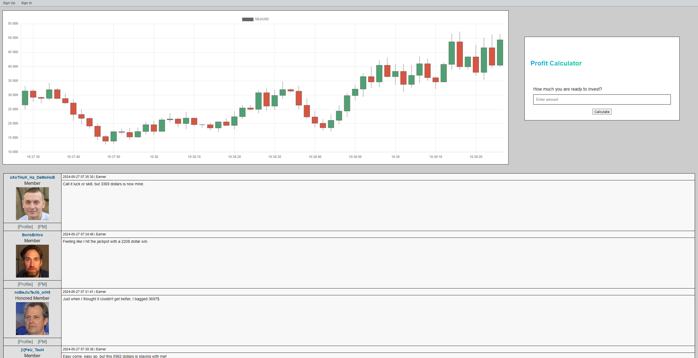

## Title
Earn Online for Bored Men

## Description
Hi bro,

Wanna spill the beans on some wealth, success, and prosperity hacks. I've read a ton and dug deep into this stuff, so here's a solid gold tip to boost your earnings. This site's a breeze for trading, keeping an eye on the trends and cashing in big time. I'm raking in serious dough, just chillin' at my computer, watching the charts dance. Trade with the trend, and you're snagging an easy $500 per round while kicking back with a cold one.

Good luck my boy, \
Robert "StockBobby" Martingale

## Solution
The entry point is simple - we can control the value passed to PHP's eval() via `".code."`-like payload in calc.php. The improper sanitization can be noticed by status code 500 when we try to send `"`. Expanding it to `"."` (PHP's string concatenation) we can verify that this endpoint is evaluating some expression with embedded user-input.

Next step is obvious, lets gather some more information with `phpinfo()`. What can be further explored:
1) Almost all shell and file manipulation functions are disabled.
2) We can read files and list directories
3) We can create and remove symlinks
4) PHP runs as an Apache module
5) Apache has mod_cgi and mod_includes enabled (which are in use for the frontend), thus it can handle Server Side Includes with "exec" directive
6) virtual() is also not disabled
7) We don't have read access to the /flag (but have +x), so we need a shell injection (which is theoretically possible due to point 5)

With that setup, to get the shell-level code execution we want a custom `.html` file in the site's root folder that will contain SSI directive like `<!--#exec cmd="{cmd}"-->`.

**Solution steps:**
1) PHP can create temporary files. The easiest method is simply attaching a file with `multipart/form-data` content type and then accessing it by `$_FILES['file']['tmp_name']`
2) We can create a symlink into the webroot. Apache will process it as a regular file without any trickery.
3) Temporary file uploads do exist up until the end of request processing and are being removed right after. To surpass this we can make an Apache Subrequest using `virtual(path)` call within the same request while the file is still presented. Or by just using very long `sleep()`, which will work in this case but may not work in some others (with blocking requests for example).

Exploit in /writeup

## Flag
SAS{1_w4n7_7o_b3l1ev3_1n_fr3e_m0n3y}

**Solved by:** 6 teams