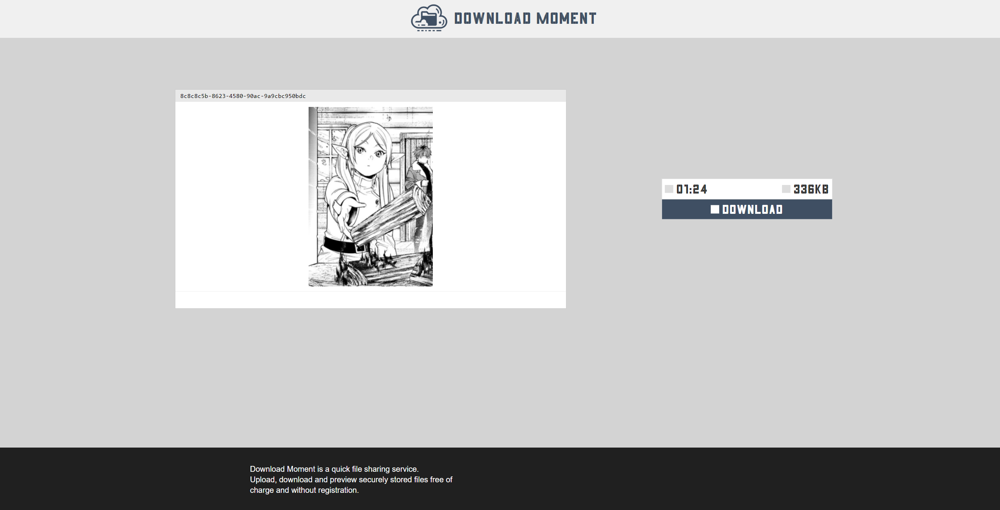

## Title

Download Moment 1/2/3

## Description

Reuben Pohpid is a well known Silicon Valley entrepreneur. This is his new magnum opus - free of charge anonymous file sharing service. Don't hesitate and try it out!

### Part 1 (web)

He who passes to the right will meet death. He who passes to the left will be sucked in the bog. And he who goes straight... Who knows what awaits him ahead? Shall he just turn back?

### Part 2 (web)

Porter Robinson - Shelter

### Part 3 (pwn)

This task is a further exploitation of Part 2. Solve it first before coming back.

## Solution

**Part 1:**

The challenge description hints us two ideas: "choosing a route" and "turning back".

Let's inspect the available routes:
- `/` serves the frontend html
- `/<uuid>` is a file preview endpoint with the same html as `/`
- `/upload` is a file upload interactor
- `/preview/<uuid>` is a file preview interactor
- `/download/<uuid>` is a file download interactor
- `/static/*` is serving static files and returning 404 for the files that do not exist
- all unmatched endpoints are redirecting to `/`

This looks quite restrictive. "Turning back" hints of possible path traversal. Luckily there are not so much path traversal misconfigurations in nginx (literally one unless you're trying dark magic with rewrites) and it's called "alias misconfiguration". The alias directive is widely used for file serving endpoints like `static`, so, by assuming that `/static` is an alias we may try `/static../`. This will result in customized "Welcome to nginx!" index page, indicating that we successfully got to the upper directory. By checking most common site root files we will find the flag in robots.txt

**Part 2:**

1) After further analyzis of the applicationb behaviour we can notice that it has file contents preview (for text, images and zip archives).
2) Archives is a perspective vector, so we may try symbolic link and Zip Slip attacks. While the first one doesn't seem to produce any results, the second one is working to our benefit. However, preview for the text files seem to contain only beginning of the file.
3) According to the response headers, functional part of the application runs on PHP. Thus we can try to read the source.
4) Upon trying most common webroot paths (or just reading the /proc/1/cmdline) we come across /var/www/html/index.php which contains include paths for the action handlers and some numeric constants.
5) After reading head slice of the preview.php, we can see how it handles image files - via imagecreatefromstring() and getimagesize(), thus supporting almost every known image extension.
6) Source files still can't be read from start to end, so we need a trick to bypass the TEXT_PREVIEW_LENGTH of 1024 bytes.
7) Due to the presence of Zip Slip, we can assume that zip preview handler extracts files somewhere and then reads them by the filename stored in the zip file entry without any truncating or path normalization, hence we can give a try for URL wrappers like php:// (and it works!)
8) That's not enough, application still reads only 1024 bytes for the preview. If only we can read it as an image. Can we?
9) With the use of iconv filterchains (php://filter/) we can prepend printable characters to the start of the resource contents, therefore we can add base64 encoded signatures of image formats.
10) This will be enough for getimagesize(), but imagecreatefromstring() is another story, it does expect valid image file with appropriate content from which it can extract the pixels.
11) Luckily for us, there's a BMP image format, that consists of 54 byte header and raw pixel data, allowing us to treat resource contents as pixels. So we need to:

- Generate BMP file header with dimensions less than MAX_DIM constant (so it won't be downscaled), target file size shouldn't be smaller than width*height\*3 of the image (but can be greater, because BMP is being read from end to start, where end is determined by the header)
- Encode this header with base64 and prepend it to the target file contents using php:// filter chain
- Extract the data from pixels

12) Now we can read any file (including binary), flag for this part can be found at the end of index.php

// Due to the fact index.php is quite small, there was an unintended solution that involved PHP filter zlib.deflate. So we added a second flag to a bigger file under the *Part 2.2*

**Part 3:**

At this point we've got the ability to read arbitrary files on the system. Unfortunately, that's not enough to get the last flag. To get it, we need to find a way to execute arbitrary code on the server and run the `/flag` binary.

1) Interestingly, while studying the source code we can see some references to FileHoover class that has no PHP source. Checking the `/proc/self/maps` file we can see that there is an extension loaded - filehoover.so.

2) Downloading it, and doing some basic re, we can see that this is a custom written helper extension that performs periodic file cleanups. What's interesting, `checksec` says that the stack canary is disabled. From this we can guess that the extension is vulnerable to buffer overflow.

3) Doing some audit of the extension, we find that there is seemingly vulnerable call to `memcpy` inside the `__toString()` method:

    ```c
    zval* directory = READ_PROPERTY("directory");

    // Copy string to local buffer
    char local_buffer[2048] = { 0 };
    memcpy(local_buffer, Z_STRVAL_P(directory), Z_STRLEN_P(directory));
    ```

4) It extracts the `directory` property from the object, and copies it to the local buffer of 2048 bytes. This is a classic buffer overflow vulnerability, as both the length and the content of the `directory` property are controlled by the user. So, by creating the `FileHoover` object with the directory name that exceeds the 2048 bytes limit it is possible to trigger the bug and get the control over the RIP.

5) That's all great, but. How to actually trigger the vulnerable code path? Here we should remember about the PHAR deserialization vulnerability. We can create a PHAR archive with the serialized `FileHoover` object and send it to the server. The server will deserialize the object and trigger the `__wakeup()` method, which in turn calls the `__toString()` method and triggers the buffer overflow.

6) To break the ASLR, we can once again check the `/proc/self/maps` as between php-fpm forks the memory layout is preserved.

7) Finally, having all the pieces together. We can create the PHAR archive that has a rop-chain that spawns the remote shell. To do so, we could do something like that:

    ```php
    #!/usr/bin/env -S php --define phar.readonly=0 

    <?php

    if ($argc < 3) {
        echo "Usage: php create_phar.php <phar archive name> <FileHoover payload (hex)>\n";
        exit(1);
    }

    class FileHoover {
        public $directory = null;

        public function __construct($directory) {
            $this->directory = $directory;
        }
    }

    $fileHoover = new FileHoover(hex2bin($argv[2]));

    $phar = new Phar($argv[1]);
    $phar->startBuffering();
    $phar->addFromString("test.txt", "text");
    $phar->setStub("\n<?php echo __HALT_COMPILER(); ?>");
    $phar->setMetadata($fileHoover);
    $phar->stopBuffering();
    ```

8) The ropchain itself simply copies the shellcode to the heap, does the `mprotect` call, and jumps to it.

    N.B. While doing the return from `PHP_METHOD`, it will corrupt part of the ropchain, for this reason we skip the problematic part of the chain:

    ```python
    # Skip part of the stack that get corrupted while returning from PHP_METHOD
    rop_chain += p64(libc_base + ADD_RSP_X148_RET)
    rop_chain += b"B" * 0x148
    rop_chain += p64(libc_base + ADD_RSP_X148_RET)
    rop_chain += b"C" * 0x148
    ```

## Flags

**Part 1:** SAS{n0w_y0u_Kn0w_wHo_i5_br3a7h1n6_d0wN_h1s_b4cK}  
**Solved by:** 13 teams

**Part 2:** SAS{3v3n_m15c0nFi6ur4t10n_C4pyb4rA_i5_4fra1d_0f_Y0u_n0W}  
**Solved by:** 10 teams

**Part 2.2:** SAS{zl1b_1s_3ff3ct1v3_bU7_n0t_en0ugh_t0_s3rv3_b1g_5tUff}  
**Solved by:** 3 teams

**Part 3:** SAS{c_4lways_4dds_som3_sp1ciness_t0_the_w3b_dev_do3snt_1t}  
**Solved by:** 1 team