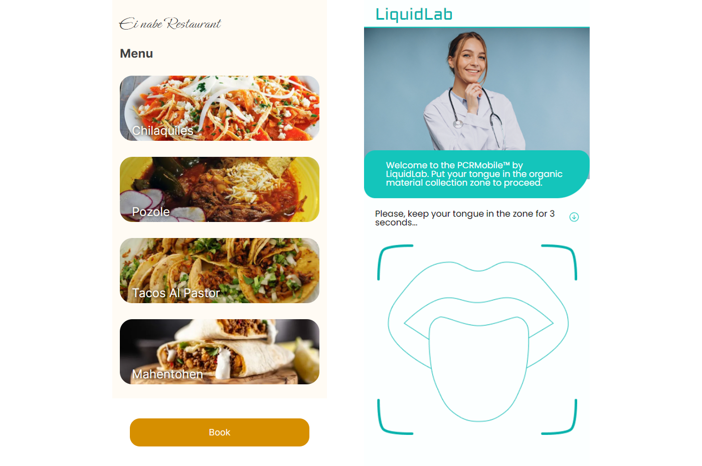

## Title
Bad old days

## Description
Evening of March 20, 2020. John is heading to his favourite restaurant to taste wonderful Mahentohen. Nothing can go wrong. Wait, what's these extra requirements? If only people there were as excited about his visit as he was...

## Solution
We have two applications. A restaurant booking service and a medical laboratory that gives you a signed PCR test results in the form of QR code. \
Restaurant service has an internal interface for booking review. It does scan QR codes on the client-side (in browser) and uses a special endpoint on LiquidLab to verify the signature. Request body, however, is constructed as `application/x-www-form-urlencoded` without proper sanitization of the decoded fields, allowing us to poison the query string with double declaration of the params.
Thus, setting the `fullname` field in QR code to something like `Wise Oldman&authorized_center=LiquidLab PCRMobile&expire=1716609348` (with authentic signature) will allow us to tamper the original fields that will later go to expiration check and, finally, page injection.

Exploitation steps:
1) Bypass QR code signature verification with query string poisoning. 
2) Rewrite the expiration date and append the XSS payload into authorized_center field.
3) Read the flag image from booking with id 0 and send it to the webhook via window.location 

Exploit in /writeup

## Flag
SAS{n1c3_0n3_bu7_b3_aw4r3_0f_b3nEf4c7or_c0p3nh4gEn}

**Solved by:** 8 teams